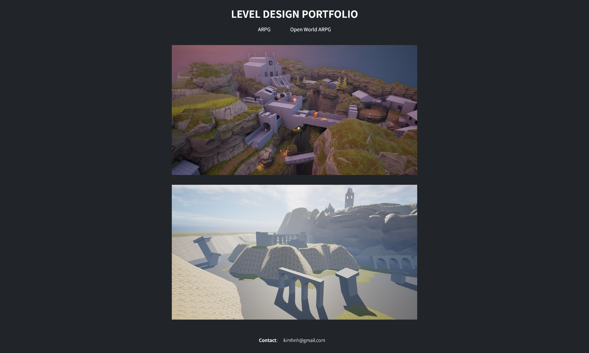

# A Level Design Portfolio

A portfolio showcasing Soulslike ARPG (Action role-playing game) levels. Each level consists of a full gameplay recording and a detailed documentation.

## 🛠️ Tools used

-   [Unreal Engine 5](https://www.unrealengine.com/en-US)
-   [Dynamic Combat System](https://www.fab.com/listings/3db11661-7930-45f8-97ed-e31f6fe8a6a4)
-   [Blockout Tools Plugin](https://dmkarpukhin.itch.io/blockout-tools-plugin)

## 🔗 Direct link to each project

| Project Name | [Three Bridges](https://kimhnh.github.io/leveldesign/pages/threeBridges.html) | [Ruinsback](https://kimhnh.github.io/leveldesign/pages/ruinsBack.html) |
| ------------ | ----------------------------------------------------------------------------- | ---------------------------------------------------------------------- |
| Genre        | ARPG                                                                          | Open world ARPG                                                        |
| Size         | 270m x 150m                                                                   | 1400m x 1000m                                                          |
